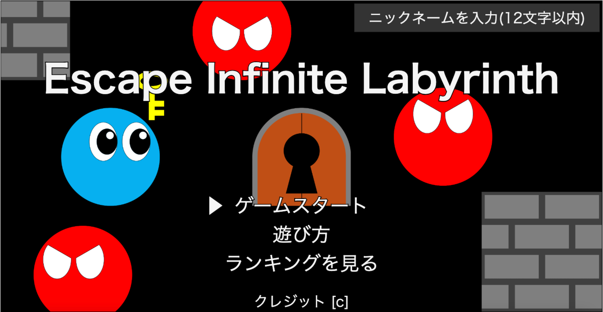
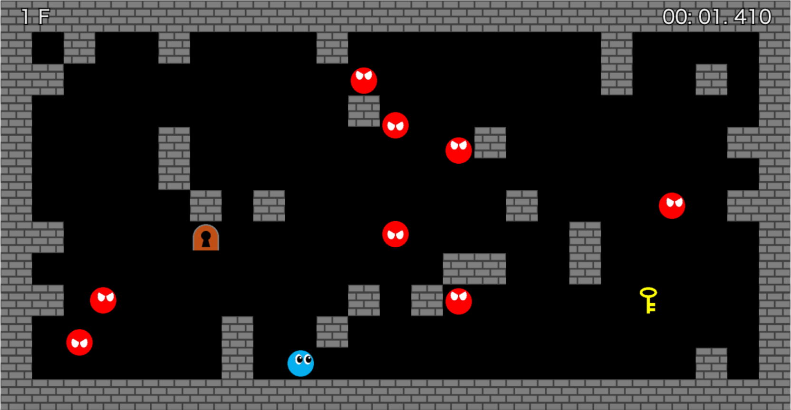
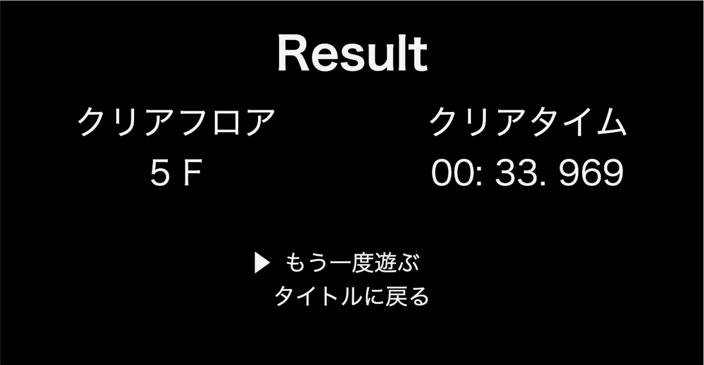
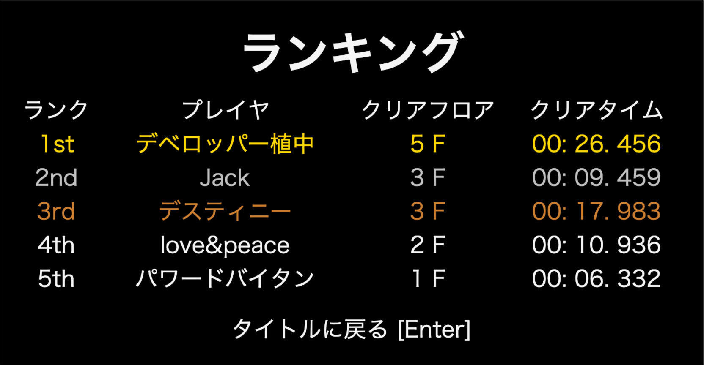

# Escape Infinite Labyrinth

## ゲームURL
[https://escape-infinite-labyrinth.vercel.app/](https://escape-infinite-labyrinth.vercel.app/)  
(**PCのみ対応)

---

## 概要
- 個人開発Webブラウザゲーム
- 初版をpygameで開発
- 初版をJavascriptで書き換え，Webブラウザ版に手動移植

## 開発目的
- 自力でゲームの要件定義からデプロイまでを行うことで，開発のノウハウを学ぶ
- 使用経験の薄かったJavaScriptに触れ，その基礎を学ぶ

## ゲーム内容
- 十字キーでキャラクタを操作し，マップ上を移動
- マップ上にある鍵を取得し，同じくマップ上のゴールに向かう
- ゴールするとマップクリアとなり，次のマップに進む
- 敵に触れるとゲームオーバー
- ゲームオーバーになるまでになるべく多くのマップを短時間でクリアすることを目指す

## スクリーンショット

<table>
  <tr>
    <td></td>
    <td></td>
  </tr>
  <tr>
    <td></td>
    <td></td>
  </tr>
</table>

## こだわり
- フェードアウト演出中に，少し重めの処理である初期マップ生成を非同期で行う
- 敵同士の衝突時の条件分岐を細かくし，敵の動きを読みづらくして難易度を上げている
- 世界ランキング機能

## 技術
- フロントエンド: Vanilla JS / HTML / CSS
- バックエンド: Vercel API Routes (Node.js)
- データベース: Supabase (PostgreSQL)
- ホスティング: Vercel

---
